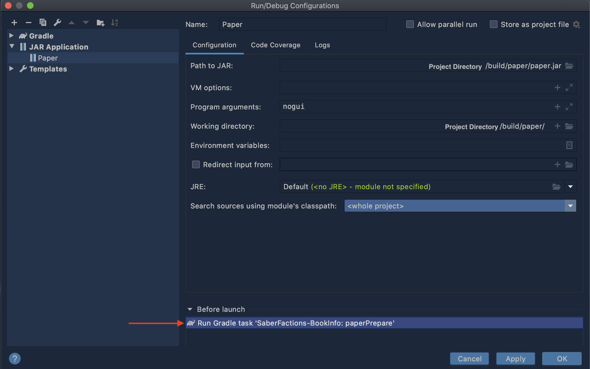

# Gradle Minecraft Server Bootstrapper

This is a Gradle plugin to easily set-up a Minecraft Server for plugin development/testing.

## How do I use it?

1. Include it on your Gradle build script,[ as described in here.](https://plugins.gradle.org/plugin/me.gabrieltk.mcrun) **Using the Plugin DSL is recommended**.
2. Set-up your project details.

    Gradle - Kotlin DSL: 
    
    ```
   configure<MCRunPluginExtension>() {
       mcVersion = "1.15.2"
       acceptEula = true //Using this line means you agree to the Minecraft EULA. It is availiable at https://www.minecraft.net/en-us/eula/
   }
   ```
   
3. Set up your server software:

    Paper (Gradle - Kotlin DSL):
    
    ```
   tasks.named<RunPaperTask>("paperPrepare"){
       dependsOn("shadowJar")
       //finalizedBy("exportDeps")
       pluginFiles = listOf("$buildDir/libs/SaberFactions-BookInfo-1.0-SNAPSHOT-all.jar",
           "$rootDir/buildComponents/RuntimeDeps/"
       )
   }
   ```
   
4. If you'd like to use with an IDE, set it up to run it before the server jar:
